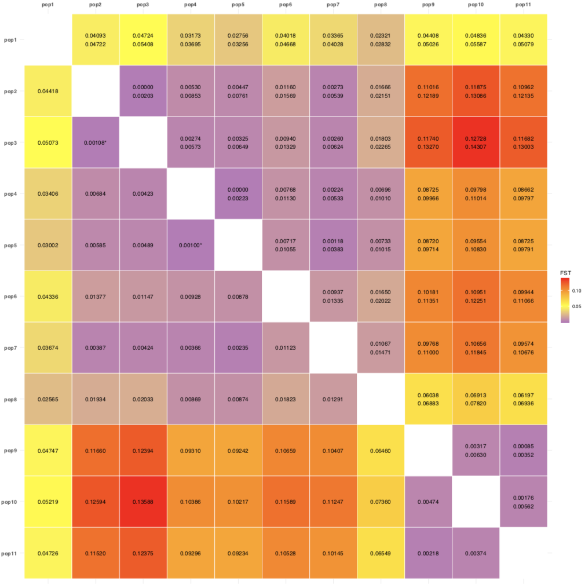
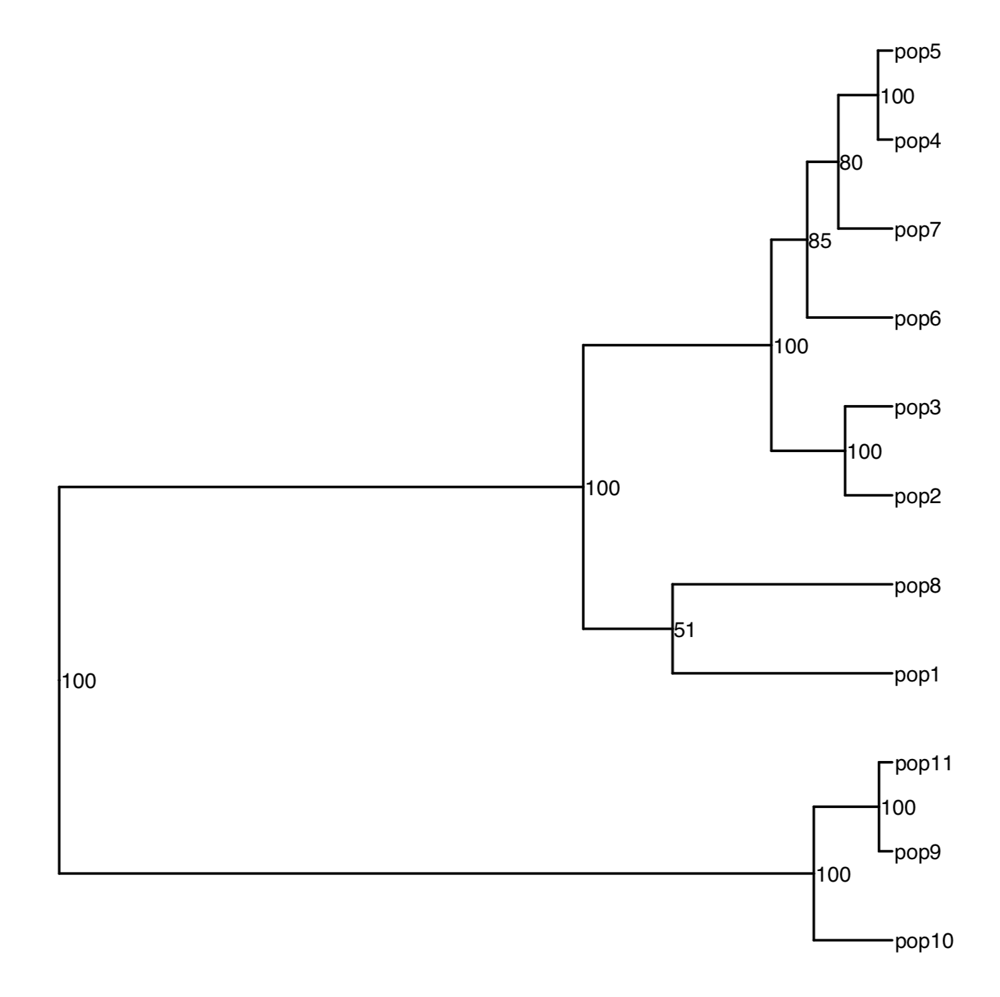

    
```{r, echo = FALSE, message = FALSE}
    knitr::opts_chunk$set(collapse = T, comment = "#>")
    options(tibble.print_min = 4L, tibble.print_max = 4L)
```
    
# Objectives
  * learn how to run the function `assigner::fst_WC84`
  * compute pairwise and overall Weir and Cockerham (1984) Fst estimates
  * build confidence intervals
  * visualize the estimates with data frame and matrices
  * learn how to integrate the function with other package, e.g. to build a phylogenetic tree
  * make Louis Bernatchez happy !
  
# Special concerns for genome-wide estimate and filtering bias 
During computation, the function first starts by keeping only the polymorphic
markers in common between the populations. 

When your project involves > 2 populations that evolved more by neutral processes
(e.g. genetic drift) than by natural selection, filtering to keep only the markers 
in common between your populations will drastically reduce the number of markers, 
and consequently your genome coverage for the estimate. Strategically, you should
reduce the threshold of number of populations required to keep a marker 
(e.g. use a minimum of 2 populations genotyped for the markers to keep it). 
This is easily tested with `radiator::filter_common_markers` or in 
stacks population module.

The overall fst and fis estimates will have reduce genome-wide coverage, 
because the computation is conducted with shared markers accross 
all your populations. However, for the pairwise comparisons, the markers will be
tallied automatically for the pair. This usually results in more legitimate markers 
(i.e. less filtering bias) being used during computation, 
providing better genome-wide estimates for that pair.

# Workflow

## Preparation

1. Clean your desk and remove the clutter in the global environment
```{r eval= FALSE}
rm(list=ls())
```

1. Required libraries
```{r eval=FALSE}
if (!require("pak")) install.packages("pak")
pak::pkg_install("thierrygosselin/assigner")
library(assigner)
```

1. Get the data:
```{r eval= FALSE}
data.fst <- readr::read_tsv(file = "https://raw.githubusercontent.com/thierrygosselin/package_data/master/assigner_data_fst.tsv.gz")
```

## Fst calculations

`assigner::fst_WC84` first run:  overall and pairwise, but without boostrap (i.e. no confidence intervals).
Get the function documentation with: `??assigner::fst_WC84`.

```{r eval= FALSE}
fst <- assigner::fst_WC84(
    data = data.fst, 
    pop.levels = c("pop1", "pop2", "pop3", "pop4", "pop5", "pop6", "pop7", "pop8", "pop9", "pop10", "pop11"),
    pairwise = TRUE,
    filename = "testing_fst", #will trigger the function to write the results in directory as well
    verbose = TRUE
)
```

## Results
After 10 sec max you should get the Fst (overall) value of 0.05


1. To view the content of `fst`:
```{r eval= FALSE}
names(fst)
```

1. Get access to specific content with `$`:
    * `$sigma.loc`: the variance components per locus: 
   `lsiga`: among populations, 
   `lsigb`: among individuals within populations, 
   `lsigw`: within individuals.
   
    * `$fst.markers`: the fst by markers
    * `$fst.ranked`: the fst ranked
    * `$fst.overall`: the mean fst overall markers and number of markers 
    * `$fis.markers`: the fis by markers 
    * `$fis.overall`: the mean fis overall markers and number of markers 
    * `$fst.plot`: the histogram of the overall Fst per markers
    * `$pairwise.fst`: the pairwise fst in long/tidy data frame and number of markers per pairwise comparison
    * `$pairwise.fst.upper.matrix`: the pairwise fst in a upper triangle matrix
    * `$pairwise.fst.full.matrix`: the pairwise fst matrix (duplicated upper and lower triangle)
    * `$pairwise.fst.ci.matrix`: matrix with pairwise fst in the upper triangle
 and the confidence intervals in the lower triangle.


1. To view the pairwise Fst values in a tibble with 4 columns:
```{r eval= FALSE}
df <- fst$pairwise.fst
```

1. The first 10 parwise comparisons in `df`
    
    *N_MARKERS*: is the number of markers used between the pairs to calculate the Fst.

    | POP1 | POP2  |  FST   | N_MARKERS |
    |:----:|:-----:|:------:|:---------:|
    | pop1 | pop2  | 0.0442 |   3457    |
    | pop1 | pop3  | 0.0507 |   3457    |
    | pop1 | pop4  | 0.0341 |   3457    |
    | pop1 | pop5  | 0.0300 |   3457    |
    | pop1 | pop6  | 0.0434 |   3457    |
    | pop1 | pop7  | 0.0367 |   3457    |
    | pop1 | pop8  | 0.0256 |   3457    |
    | pop1 | pop9  | 0.0475 |   3457    |
    | pop1 | pop10 | 0.0522 |   3457    |
    | pop1 | pop11 | 0.0473 |   3457    |


1. The matrix with fst values:
```{r eval= FALSE}
# to see as a tibble:
fst.matrix <- tibble::as_tibble(fst$pairwise.fst.full.matrix, rownames = "POP")
# to keep matrix:
fst.matrix <- fst$pairwise.fst.full.matrix
```
1. If you try to get the `pairwise.fst.ci.matrix`:
```{r eval= FALSE}
fst$pairwise.fst.ci.matrix # you will get this:
[1] "confidence intervals not selected"
```

1. So let's make another run with `fst_WC84`, but this time will ask for the confidence intervals and the heatmap:
```{r eval= FALSE}
fst.ci <- fst_WC84(data = data.fst, 
    pop.levels = c("pop1", "pop2", "pop3", "pop4", "pop5", "pop6", "pop7", "pop8", "pop9", "pop10", "pop11"),
    pairwise = TRUE,
    ci = TRUE, 
    iteration.ci = 100,
    quantiles.ci = c(0.025, 0.975),
    parallel.core = 12,
    heatmap.fst = TRUE,
    filename = "testing_fst",
    verbose = TRUE
)
```

    `fst.ci$pairwise.fst` is the tibble with the Fst values and now with the confidence intervals.

1. Try again to get the matrix with fst and ci:
```{r eval= FALSE}
fst.ci$pairwise.fst.ci.matrix
```

1. To have this in a handy table for publication, we will create a new object `pairwise.fst.ci.df`:
```{r eval= FALSE}
pairwise.fst.ci.df <- tibble::as_tibble(fst.ci$pairwise.fst.ci.matrix, rownames = "POP")
# if you have numeric pop_id identifier you might have to do this to get proper column names:
colnames(pairwise.fst.ci.df) <- colnames(fst.ci$pairwise.fst.ci.matrix)
# to save:
readr::write_tsv(x = pairwise.fst.ci.df, path = "pairwise.fst.ci.df.tsv")
```

1. Or even better, use the heatmap of Fst and CI values...:
<center>

<center>


## Phylogenetic tree
For the next steps, we need the full distance matrix created in step 10.

1. For a Neighbor joining tree:
```{r eval= FALSE}
# build the tree:
require(ape)
tree <- ape::nj(X = fst.matrix) # fst.matrix as a matrix
# for annotating bootstraps values on the tree:
bootstrap.value <- ape::boot.phylo(
    phy = tree, 
    x = fst.matrix, 
    FUN = function(x) ape::nj(x), 
    block = 1, 
    B = 10000, 
    trees = FALSE, 
    rooted = FALSE
    )
 # to get percentage values
bootstrap.value <- round((bootstrap.value/10000)*100, 0)
bootstrap.value
# to include in the tree
tree$node.label <- bootstrap.value 
```

1. For a UPGMA tree:
```{r eval= FALSE}
require(stats)
tree <- ape::as.phylo(stats::hclust(stats::dist(fst.matrix), method = "average"))
bootstrap.value <- ape::boot.phylo(phy = tree, x = fst.matrix, FUN = function(xx) ape::as.phylo(stats::hclust(stats::dist(xx), method = "average")) , block = 1, B = 10000, trees = FALSE, rooted = TRUE) 
bootstrap.value <- round((bootstrap.value/10000)*100, 0)
bootstrap.value
tree$node.label <- bootstrap.value
```

1. To build the tree we will need to install \pkg{ggtree}
```{r eval= FALSE}
# get the latest development version of ggtree:
if (!require("ggtree")) install_github("GuangchuangYu/ggtree")
# If it's not working, use the Bioconductor version:
if (!requireNamespace("BiocManager", quietly = TRUE)) install.packages("BiocManager")
BiocManager::install("ggtree")
```
1. Several vignettes are available to get to know [ggtree](http://guangchuangyu.github.io/ggtree/)

1. Build a very basic tree figure:
```{r eval= FALSE}
require(ggtree)
require(ggplot2)
tree.figure <- ggplot2::ggplot(tree, ggplot2::aes(x, y), ladderize = TRUE) + 
    ggtree::geom_tree() + 
    # geom_tiplab(size = 3, hjust = -0.05, vjust = 0.5)+ # for just the tip label
    ggplot2::geom_text(ggplot2::aes(label = label), size = 3, hjust = -0.05, vjust = 0.5) + # for both tips and nodes
    ggtree::theme_tree() + 
    ggplot2::xlim(0, 0.16) # to allocate more space for tip labels (trial/error)
tree.figure
ggplot2::ggsave(filename = "assigner.fst.tree.example.pdf", width = 15, height = 15, dpi = 600, units = "cm", useDingbats = FALSE)
```




# Conclusion

Please send me suggestions and bug reports through github

**References**

Weir BS, Cockerham CC (1984) Estimating F-Statistics for the 
Analysis of Population Structure. Evolution, 38, 1358–1370.

G Yu, D Smith, H Zhu, Y Guan, TTY Lam,
ggtree: an R package for visualization and annotation of phylogenetic tree with different types of meta-data.
revised.


