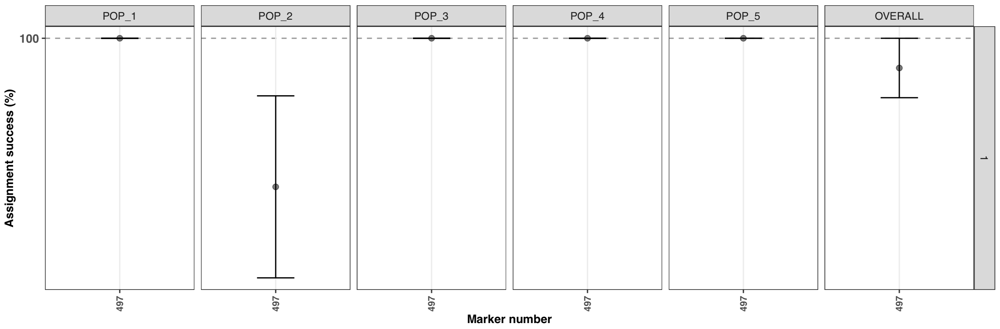
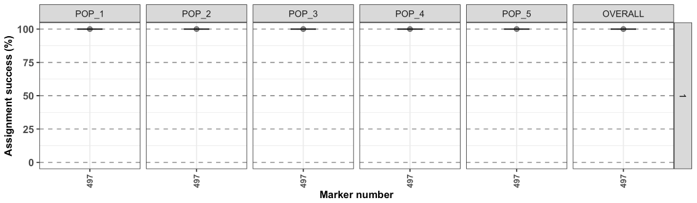
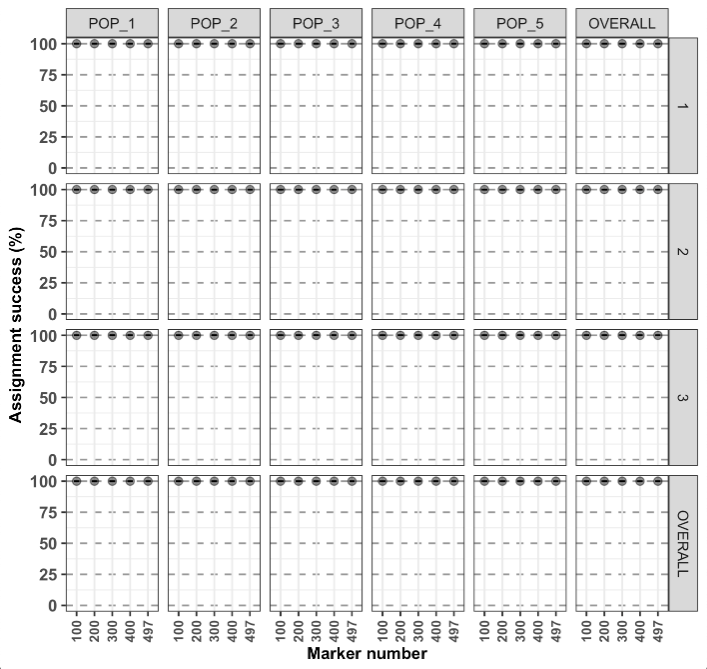
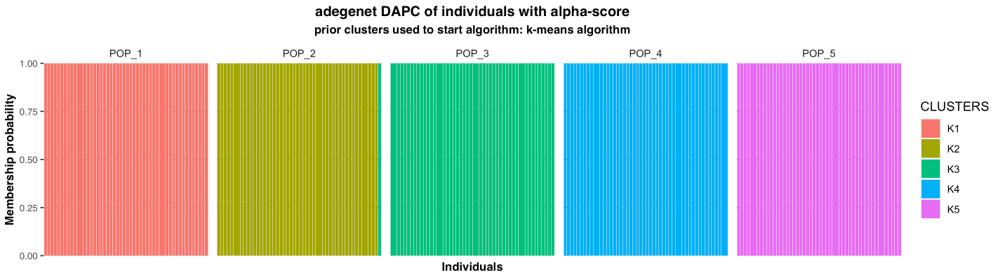
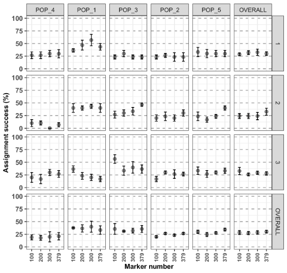
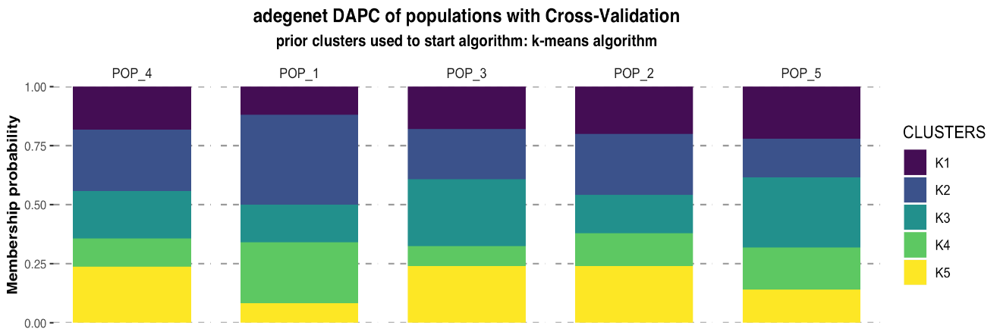
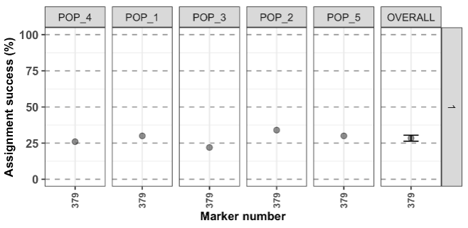

# Objectives

With this vignette, you should be able to learn the basics in under 30 minutes.

Assumptions:

* You've read the [function documentation on the web](http://thierrygosselin.github.io/assigner/reference/assignment_ngs.html) or with `?assigner::assignment_ngs`.
* You've read Eric's paper:
Anderson EC (2010) Assessing the power of informative subsets of loci for population assignment: standard methods are upwardly biased. Molecular Ecology Resources, 10, 701–710.
* **assigner** is installed. If not, follow the [install instructions](http://thierrygosselin.github.io/assigner/).


# Prepare your workspace

* clean your workspace `rm(list = ls())`
* load assigner

```{r Prepare your workspace, eval = FALSE}
library(assigner)
```

By default, the working directory is where the file for this vignette is. 
To change: `setwd("new path here")`


# Data 1: high structure

For this exercise, we use the first dataset included in assigner.
It's a simulated dataset generated with [grur](https://thierrygosselin.github.io/grur/reference/simulate_rad.html).
Details of the dataset are available using: `?assigner::data_assigner_sim_01`.

```{r load data, , eval = FALSE}
data <- data_assigner_sim_01
```


# Analysis using THL with `gsi_sim`

The analysis below uses the **cross-validation technique**
called *Training, Holdout, Leave-one-out (THL)*:

* the *training* of the model is conducted on 0.8 (80%) of the samples (per strata/pops)
* all the markers are ranked based on [Fst](http://thierrygosselin.github.io/assigner/reference/fst_WC84.html),
  only the training samples are used to generate the Fst.
* the holdout samples consist of 0.2 or 20% of the samples. 
  These are the samples assigned with [gsi_sim](https://github.com/eriqande/gsi_sim).
* the process of taking a subsample of individuals (holdout and training set) to 
train the model and conduct the assigment analysis with **gsi_sim** is repeated 
5 times (`iteration.method = 5`).

`gsi_sim` is not distributed with **assigner**, follow the [install instruction](http://thierrygosselin.github.io/assigner/), here for my mac it's:

```{r install gri_sim, eval = FALSE, include=TRUE}
assigner::install_gsi_sim(fromSource = TRUE)
```

## no subsampling
```{r THL analysis with gsi_sim, eval = FALSE}
test1 <- assigner::assignment_ngs(
  data = data,
  assignment.analysis = "gsi_sim",
  markers.sampling = "ranked", 
  thl = 0.2,
  iteration.method = 5
)
#>################################################################################
#>########################## assigner::assignment_ngs ############################
#>################################################################################
#>Execution date/time: 20190501@1104
#>Assignment analysis with gsi_sim
#>Folder created: assignment_analysis_method_ranked_20190501@1104
#>Calibrating REF/ALT alleles...
#>Subsampling: not selected
#>Conducting Assignment analysis using Training, Holdout, Leave-one-out
#>Using training samples to rank markers based on Fst
#>Holdout samples saved in your folder
#>Starting parallel computations, for progress monitor activity in folder...
#>
#>Computation time, overall: 7 sec
#>########################## assignment_ngs completed ############################
```

By default, the function uses all the markers and all my CPUs - 1, to change this last behavior use the
argument `parallel.core`.

The most important information that you'll probably want to see are both
returned in the working directory and the object. Not much is kept in the object `test1`, because disk space is cheap, memory is not!

```{r returned in test1, eval = FALSE}
names(test1)
#>[1] "assignment"      "assignment.plot"
```

Written in the working directory under `assignment_analysis_method_ranked_date@time`, where `date@time` is the 
date and time the function was run:
```{r test1 in directory, eval = FALSE}
# 01_radiator_tidy_genomic: folder
# assigner_assignment_ngs_args_20190501@1102.tsv: tibble, file
# assignment_1: folder
# assignment_2: folder
# assignment_3: folder
# assignment_4: folder
# assignment_5: folder
# assignment.plot.pdf: figure
# assignment.ranked.results.iterations.raw.tsv: tibble, file
# assignment.ranked.results.iterations.summary.tsv: tibble, file
# assignment.results.summary.stats.tsv: tibble, file
# holdout.individuals.tsv: tibble, file
```

These folders and files are detailed in the function documentation under [value](http://thierrygosselin.github.io/assigner/reference/assignment_ngs.html#value) returned by the function.

To see the figure:
```{r thl figure, eval = FALSE}
test1$plot.assignment
```

By default, the figure display the range of the data, to change this behavior
and see the full range for the y axis:

```{r y axis full range, message=FALSE, warning=TRUE, eval = FALSE}
test1$plot.assignment + ggplot2::scale_y_continuous(limits = c(0,100)) 
```



* assignment is very high for all populations (the points are mean values and
the error bar represent the SE based on the 5 iterations).
* the horizontal facet display a `1`, because subsampling of the samples was
not used, only 1 set was calculated with all samples. An example below will
show something different.
* the x-axis display the number of marker used `497`. Using `dplyr::n_distinct(data$MARKERS)` shows that the dataset contains 500 markers, as description of the dataset suggest, so why a lower number was used? By default, the function will keep only polymorphic markers in common between strata/pops ([doc](http://thierrygosselin.github.io/assigner/reference/assignment_ngs.html#assumptions)). Removing samples from the original simulated data, and low MAC result in losing 3 markers. If you want to clean the data before running the function:

```{r polymorphic markers in common, eval = FALSE}
data %<>% 
  radiator::filter_monomorphic(data = .) %>%
  radiator::filter_common_markers(data = .)
#>Filter monomorphic markers
#>Number of individuals / strata / chrom / locus / SNP:
#>    Blacklisted: 0 / 0 / NA / NA / 3
#>
#>Filter common markers:
#>Number of individuals / strata / chrom / locus / SNP:
#>    Blacklisted: 0 / 0 / 0 / 0 / 0
```


## with subsampling

For the second test, we will test several marker numbers and
use the subsampling arguments to select 30 individuals in each strata (repeating this 3 times).

```{r THL analysis with gsi_sim and subsample, eval = FALSE}
test2 <- assigner::assignment_ngs(
  data = data,
  assignment.analysis = "gsi_sim",
  markers.sampling = "ranked", 
  thl = 0.2,
  iteration.method = 5, 
  marker.number = c(100, 200, 300, 400, "all"),
  subsample = 30, 
  iteration.subsample = 3
)
#> ################################################################################
#> ########################## assigner::assignment_ngs ############################
#> ################################################################################
#> Execution date/time: 20190501@1158
#> Assignment analysis with gsi_sim
#> Folder created: assignment_analysis_method_ranked_20190501@1158
#> Calibrating REF/ALT alleles...
#> Subsampling: selected
#>     using subsample size of: 30
#> 
#> Analyzing subsample: 1
#> Conducting Assignment analysis using Training, Holdout, Leave-one-out
#> Using training samples to rank markers based on Fst
#> Holdout samples saved in your folder
#> Starting parallel computations, for progress monitor activity in folder...
#> 
#> Analyzing subsample: 2
#> Conducting Assignment analysis using Training, Holdout, Leave-one-out
#> Using training samples to rank markers based on Fst
#> Holdout samples saved in your folder
#> Starting parallel computations, for progress monitor activity in folder...
#> 
#> Analyzing subsample: 3
#> Conducting Assignment analysis using Training, Holdout, Leave-one-out
#> Using training samples to rank markers based on Fst
#> Holdout samples saved in your folder
#> Starting parallel computations, for progress monitor activity in folder...
#> 
#> Computation time, overall: 19 sec
#> ########################## assignment_ngs completed ############################
```

The object generated is similar to the analysis witout subsampling. The output 
folder is different. The subsample folders have the same content as the output
of the analysis witout subsampling.

```{r output folder subsampling, eval = FALSE}
# 01_radiator_tidy_genomic: folder
# assigner_assignment_ngs_args_20190501@1540.tsv: tibble, file
# assignment.plot.pdf: figure
# assignment.ranked.results.summary.stats.all.subsamples.tsv: tibble, file
# assignment.results.summary.stats.tsv: tibble, file
# subsample_1: folder
# subsample_2: folder
# subsample_3: folder
# subsampling_individuals.tsv: tibble, file
```


To view the figure:
```{r y axis full range test2, message=FALSE, warning=TRUE, eval = FALSE}
test2$plot.assignment + ggplot2::scale_y_continuous(limits = c(0,100)) 
```


* The last vertical and horizontal facets are the mean assignment for all the 
subsampling iterations and mean assignment over populations, respectively.
* With the last plot, in the lower right corner, corresponding to the overall
average (subsampling and strata/pops).
* the number of markers doesn't affect the assignment analysis, the top 100 markers
are as good as using all the 497 markers. Keep in mind that this is rarely the 
case with real datasets...


This dataset as a high overall Fst value:

```{r fst dataset1, eval = FALSE}
assigner::fst_WC84(data) %$% fst.overall$FST
#>[1] 0.39603
```

The look of the membership probabilities with `adegenet` dapc analysis would show
something similar to this:




# Data 2: low structure

Let's try the same analysis, but this time with a dataset with lower Fst.
It's a simulated dataset generated with [grur](https://thierrygosselin.github.io/grur/reference/simulate_rad.html).
Details of the dataset are available using: `?assigner::data_assigner_sim_02`.

```{r load data low fst, eval = FALSE}
data <- data_assigner_sim_02
```


# Analysis using THL with `gsi_sim`

```{r THL analysis on low fst dataset using gsi_sim and subsample, eval = FALSE}
test3 <- assigner::assignment_ngs(
  data = data,
  assignment.analysis = "gsi_sim",
  markers.sampling = "ranked", 
  thl = 0.2,
  iteration.method = 5, 
  marker.number = c(100, 200, 300, 400, "all"),
  subsample = 30, 
  iteration.subsample = 3
)
```

To view the figure:
```{r y axis full range test3, message=FALSE, warning=TRUE, eval = FALSE}
test3$plot.assignment + ggplot2::scale_y_continuous(limits = c(0,100)) 
```


* Very different overall results...
* For the assignment analysis of species exhibiting overall low structure, 
using more markers will, generally, help the assingnment (if the data is filtered correctly...)


This is the overall Fst value:

```{r fst dataset2, eval = FALSE}
assigner::fst_WC84(data) %$% fst.overall$FST
#>[1] 0.001320833
```

This is the membership probabilities with `adegenet` dapc analysis:



The populations are very admixed because of the high migration rate used during
the simulations.


# Analysis using LOO with gsi_sim

Let's try using the *Leave-One-Out* cross-validation technique with dataset2.
With this method, there is no potential bias during marker selection, you can used
all the markers with `marker.number = "all"` or a string of marker numbers like the
example above, but here, there's no point in using less markers randomly.

The *Leave-One-Out* method means that the allele frequencies are calculated 
without the sample being assigned. This is repeated for each sample.

```{r loo, eval = FALSE}
test4 <- assigner::assignment_ngs(
  data = data,
  assignment.analysis = "gsi_sim",
  markers.sampling = "random", 
  marker.number = "all"
)
#> ################################################################################
#> ########################## assigner::assignment_ngs ############################
#> ################################################################################
#> Execution date/time: 20190501@1317
#> Assignment analysis with gsi_sim
#> Folder created: assignment_analysis_method_random_20190501@1317
#> Calibrating REF/ALT alleles...
#> Subsampling: not selected
#> Conducting Assignment analysis with markers selected randomly
#> Making a list containing all the markers combinations
#> Starting parallel computations, for progress monitor activity in folder...
#> Summarizing the assignment analysis results by iterations and marker group
#> Compiling results
#> ########################## assignment_ngs completed ############################
```

To view the figure:
```{r loo y axis full range test4, message=FALSE, warning=TRUE, eval = FALSE}
test4$plot.assignment + ggplot2::scale_y_continuous(limits = c(0,100)) 
```


Conclusion: not much to gain here by using the LOO...
